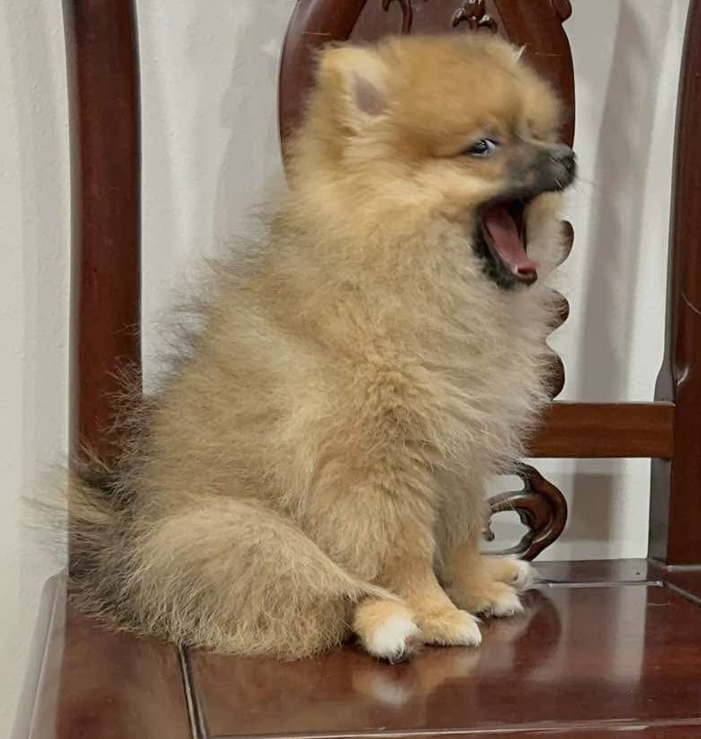

  

<h1 align="left">Hi, I'm Minh Le 👋</h1>

## 🚀 About Me

- Data Analytics @ **Denison University** (*Class Valedictorian - Summa Cum Laude*)
- Data Science Intern @ **Park National Bank**
- AI Data Engineer Intern (Team Lead) @ **Law Office of Bryan Davenport x Denison Consulting**
- AI/ML Fellow @ **Allstate**
- Data Consultant Intern @ **DHL Supply Chain**
- Data Science Intern @ **Center of Science and Industry (COSI)**
- Head Tutor @ **Denison Academic Resource Center**

 

## 🏆 Achievements

- 🏆 **1st Place @ JPMorgan Chase × ASA DataFest**
- 🏆 **1st Place @ Denison Big Red Data Challenge**
- 🥈 **2nd Place @ Accenture × University of Cincinnati Case Competition**
- 🥉 **3rd Place @ Undergraduate Statistics Project Competition**
- 🎖️ **6th Place @ Vietnamese Student HackAIthon 2026**
- 🌟 **Phi Beta Kappa (Top 1%)**
- 🏅 **Jessen T. Havill Director's Award (Data Analytics Program)**
- 📐 **Forbes B. Willey Mathematical Excellence Award**

## 🛠 Tech Stack

### Languages

### Frameworks & Libraries

### Tools

## 📌 Featured Projects

  

    🎧 <b>Audible Narrator Classifier </b> | <i>Senior Thesis</i>
  

  
- Built a **CNN-based audio classification model** achieving **91% accuracy** on pitch-derived narrator features
- Engineered an end-to-end pipeline processing **2M+ audio records** using TensorFlow and DuckDB for efficient experimentation
  

  

    🚗 <b>Allstate Claim Cost Prediction</b> | <i>AI/ML Fellowship @ Cornell Tech (Break Through Tech)</i>
  

  
- Performed EDA and feature engineering on **180K+ auto insurance claims** to uncover key cost drivers  
- Improved baseline performance using **Random Forest and XGBoost**, achieving a **10% reduction in MAE**
  

  

    💫 <b>Senior Consultant @ Denison Consulting Program </b>
  

  
- Client 1: [FORJAK Industrial](https://www.forjakindustrial.com/)
- Client 2: [Callahan & Associates](https://callahan.com/)
- Client 3: [DHL Supply Chain](https://www.dhl.com/vn-en/home/supply-chain/about-us.html)
- Client 4: [Capital Link](https://www.linkedin.com/company/capital-link-inc./)
  

<!-- 

  
  

 -->

## 📫 Let’s Connect

- 💼 LinkedIn: https://linkedin.com/in/lqminhh  
- 📧 Email: minhleq.work@gmail.com

